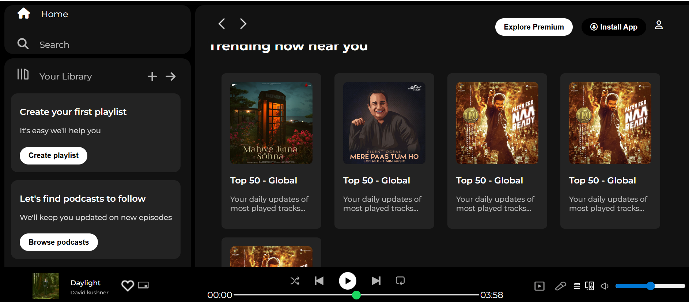
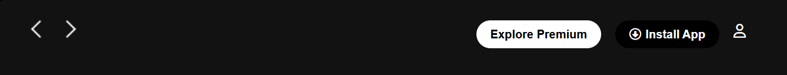
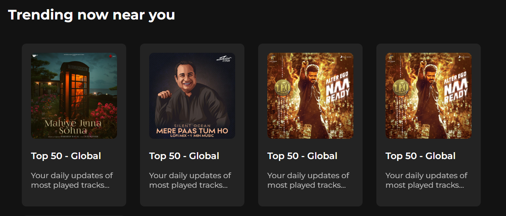

 #  🎧 Spotify Clone using HTML and Css (UI Only)

1. This is a front-end-only clone of the 
   Spotify web application. 

2. It replicates the look and feel of Spotify 
   using **HTML** and **CSS**.

3. It does not include backend or music streaming
   functionality.

## 🖼️ Project Preview

## 🧑‍💻 Technologies Used

- **HTML5**
- **CSS3** (Flexbox, Media Queries)
- **Icons**: Font Awesome, Google font

## ✅ Features Implemented

- Header navigation bar (Explore Premium,Install App,Profile)

- Sidebar with menu options (Home, Search, Library)

- Main content area with:
  - Recently played
  - Featured playlists
  - Song cards 
  

- Music player layout at the bottom (UI only)

> ⚠️ **Note:** No actual functionality like play/pause or API integration. This is a static UI clone for learning and design practice.

